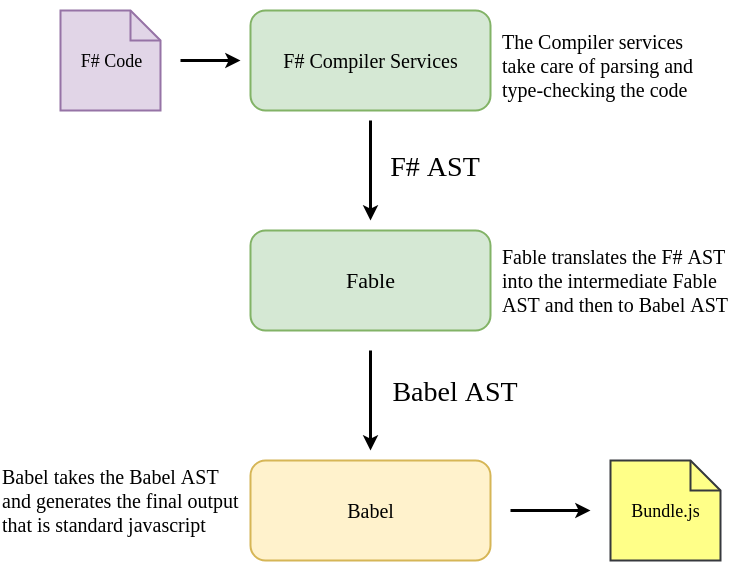

# How Fable Works

The compiler operates on F# source code directly, using the [F# Compiler Services](https://fsharp.github.io/FSharp.Compiler.Service/) for parsing and type-checking the code. Once the code is parsed, a representation of the structure of F# code is obtained, also known as an abstract syntax tree (AST). This structure is then tranformed into a specialized simpler Fable AST that is easier to work with. Afterwards, the actual translation begins by transforming the Fable AST into [Babel](https://babeljs.io/) AST representing the structure of the Javascript code that will be generated. 

The `Fable -> Babel` transformation is implemented as a set of what is called *replacements*. Parts of the F# code are replaced with parts of Javascript code. These parts could be different kinds of declations, function calls, loop constructs etc. These are translated to their counter part in Javascript. The resulting Babel AST is then handed off to the Babel compiler that will actually generate the final output.

This diagram below shows an overview of the process.

