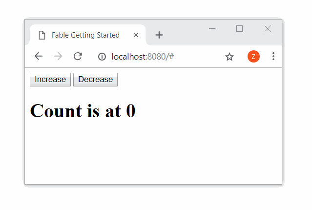

### Building a counter application

Let us now try to build something that not only has multiple elements, but also keeps track of and manipulates some local *state*. A counter application is the best candidate for these simple requirements. We can build something that looks like this: 



As you can see, we want buttons that change the contents of a text element every time you click one of them. To build this from the template, we will add two button tags to the `index.html` page and give them identities `"increase"` and `"decrease"`. We will also add a header element with id `"countViewer"` where we will show the current count, here is how  `index.html` will look like:

```html
<!doctype html>
<html>
<head>
  <title>Fable Getting Started</title>
</head>
<body>
  <button id="increase"> Increase </button> 
  <button id="decrease"> Decrease </button> 
  <h1 id="countViewer"></h1>

  <script src="bundle.js"></script>
</body>
</html>
```

Now we will do something similar like we did back with our last example that prints the console message: get references to the buttons by their id values and attaching event handlers. Because we want to keep local state of the current count, we will use a mutable value. The `App.fs` becomes the following:

```fs
module App

open Fable.Import.Browser

let increase = document.getElementById "increase"
let decrease = document.getElementById "decrease"
let countViewer = document.getElementById "countViewer"
 
let mutable count = 0

increase.onclick <- fun ev ->
    count <- count + 1
    countViewer.innerText <- sprintf "Count is at %d" count

decrease.onclick <- fun ev ->
    count <- count - 1
    countViewer.innerText <- sprintf "Count is at %d" count

countViewer.innerText <- sprintf "Count is at %d" count
```