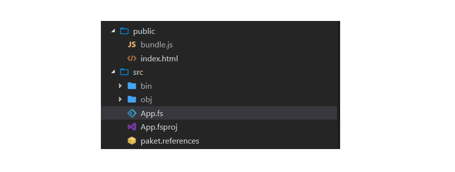
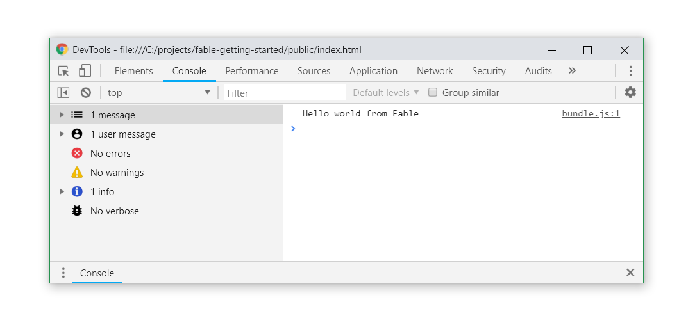
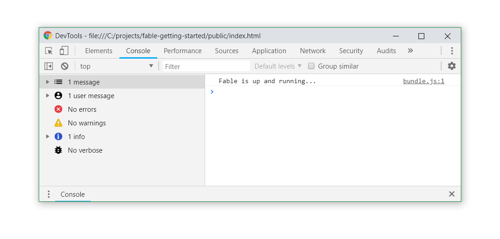
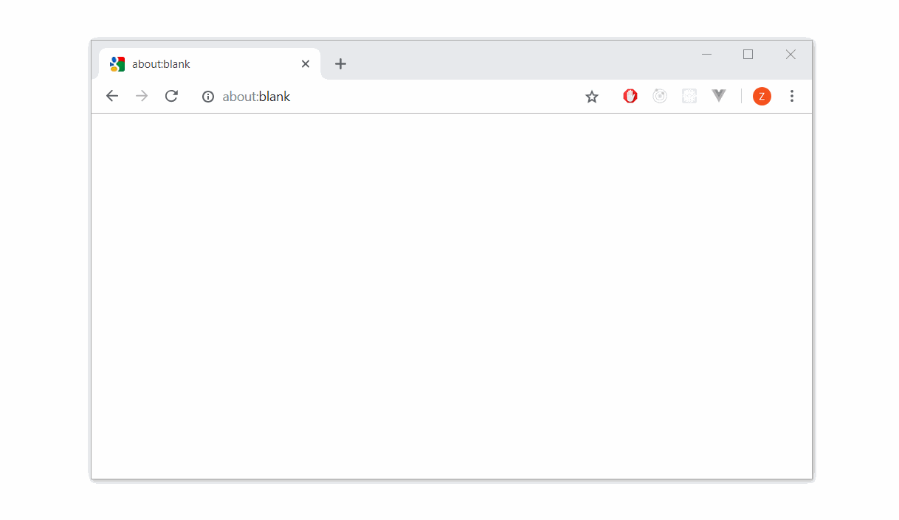

# Hello World with Fable
-------

### Starter Template

To get started with Fable, it is easier to use a template instead of building your own from scratch, for that I have set up a simple hello world fable application in the [fable-getting-started](https://github.com/Zaid-Ajaj/fable-getting-started) repo, if we take a look around the repository, it has the following structure:
```
fable-getting-started
    | 
    │  .gitattributes
    │  .gitignore
    │  .travis.yml
    │  build.cmd
    │  build.fsx
    │  build.sh
    │  LICENSE
    │  package-lock.json
    │  package.json
    │  paket.dependencies
    │  paket.lock
    │  README.md
    │  webpack.config.js
    ├─── .paket
    │     |-- paket.exe
    │     |-- Paket.Restore.targets
    │     |-- paket.targets
    ├─── .vscode
    │     |-- settings.json
    ├─── public
    │     |-- index.html
    └─── src
          |-- App.fs
          |-- App.fsproj
          |-- paket.references
```
You might be thinking *"these are many files for a hello world app!"* we will discuss the structure of the template as well as the purpose of each file in great detail soon, for now bear with me, I intend to use similar structure for projects in the upcoming chapters so understanding this one will help greatly. 

The most important parts of the template are these directories:
-  `src` is where your F# source code lives 
-  `public` is the ouput directory when you compile F# to javascript 

The only F# source file in the project is `App.fs` and it contains the following:
```fs
module App

printfn "Hello world from Fable" 
```
When the F# project is compiled using Fable, a single javascript file called `bundle.js` will be output in the `public` directory, the `bundle.js` file in turn, is referenced by `index.html` , also in the `public` directory:
```html
<!doctype html>
<html>
<head>
  <title>Fable Getting Started</title>
</head>
<body>
  <script src="bundle.js"></script>
</body>
</html>
```

### Build Requirements
In order to run your F# code in the browser, you will first need to compile the project and then run `index.html` in your browser. However, before being able to compile the project, there are a couple of requirements that you need installed on your machine:

- [.NET Core](https://www.microsoft.com/net/download) 2.1+ (both SDK and runtime)
- [Mono](https://www.mono-project.com/download/stable/) 5.0+ for non-windows machines
- [Node.js](https://nodejs.org/en/) 10.0+ 

Ofcourse having a code editor is not a requirement for building the project but rather for developement, for editing F# code, it is highly recommended to have [VS Code](https://code.visualstudio.com/) installed (along with the [Ionide](http://ionide.io/) extension).

> Q: *"Ok, but don't I need to install the Fable compiler as well?"* <br />
A: No, the Fable compiler get installed as a development dependency of the template once the packages are restored. 


### Building the project

Assuming you have installed the build requirements, you can check if you have the correct versions by running these commands in your terminal:
```bash
dotnet --version 
node --version
mono --version # if you are using Linux or macOs 
```
After you have verified the versions you can clone the starter template repository from github and compile the whole project, on windows:
```
git clone https://github.com/Zaid-Ajaj/fable-getting-started.git
cd fable-getting-started
build 
```
on linux or macOs:
```
git clone https://github.com/Zaid-Ajaj/fable-getting-started.git
cd fable-getting-started
./build.sh  
```
I use windows, so the compilation looks as follows on my machine


As you can see, a bunch of things happend in there, the template doesn't try to hide the build steps. After the build is finished, there should be a `bundle.js` file in your `public` directory:
  
 

Now that we have the javascript generated, we can open  `index.html` page in the browser, it will look blank because we haven't added anything to it, but you can open the developer tools tab and look at the browser console, we should see the message `"Hello world from Fable"` printed out:



Congrats! We have just got our first Fable application running. Let us change the source code to make it print a different message and recompile. Go to `App.fs` and change the contents to:
```fs
module App

printfn "Fable is up and running..."
```
then run `build` or `./build.sh` if you are on linux or macOs to recompile the project. This time the compilation will take significantly less time than the first build, this is because the template downloaded all dependencies it needed before. Now you can refresh the `index.html` page in the browser and see the new message printed out in the browser console:



### User Interaction

Of course, printing out a message to the console is boring. We can try something slightly less boring with some user interaction, we are running our code in the browser after all. So let us add a button that will print a message in the console when clicked. First things first, add the button to the `index.html` page:

```html
<!doctype html>
<html>
<head>
  <title>Fable Getting Started</title>
</head>
<body>
  <button id="printMsg">Print Message</button>
  <script src="bundle.js"></script>
</body>
</html>
``` 
Here, we have added a `button` tag to the page with identity attribute called `"printMsg"`, we will use the id to reference the button from the F# code. Modify the contents of `App.fs` to the following:
```fs
module App

open Fable.Import.Browser

let printMsg = document.getElementById "printMsg"

printMsg.onclick <- fun eventArgs ->
    printfn "Button clicked"
```
As you can see, line 3 opens the namespace to `Fable.Import.Browser`. This is the first example of a Fable *binding*: a library that allows our code to access native javascript API's. In this example, we use `document` with which we can reference and manipulate elements on the page, see [full docs here](https://developer.mozilla.org/en-US/docs/Web/API/Document) of `document`. Then at line 5, we ask `document` to give us a reference for the HTML element that has id `"printMsg"`, i.e. the button tag we added earlier to the `index.html` page. After that, we attach an *event handler* to the button element: a function that will run when the button is clicked. 

Now you can save `App.fs` and recompile using `build` or `./build.sh`, refresh the page and you should get something that looks like this:

